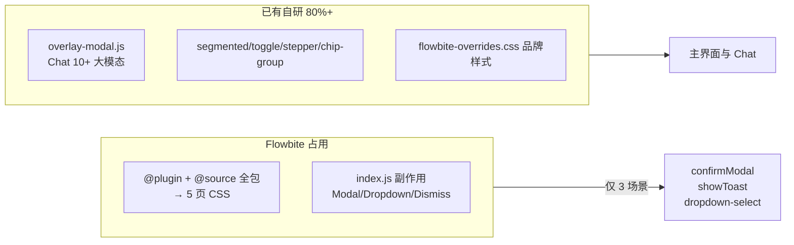
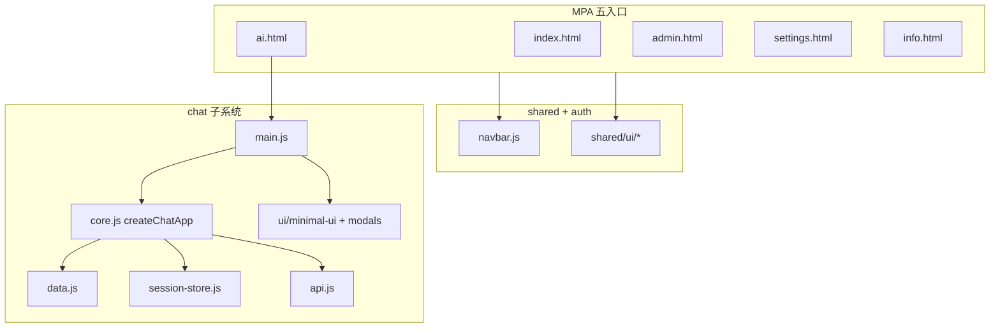
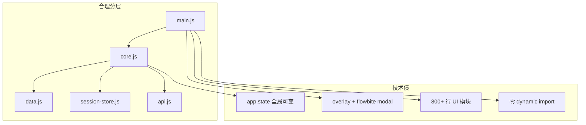

# MCP-Client 前端架构与体积调查报告

> **调查日期**：2026-06-15  
> **范围**：`frontend/` 源码、`public/` 构建产物、依赖与迁移文档  
> **方法**：全量代码审计 + `pnpm run build:frontend` 基线测量 + 2026 业界参考对照

---

## 执行摘要

| 调查问题 | 结论 |
|----------|------|
| **去掉 Flowbite 改自研是否更好？** | **是。** 项目已 80%+ 自研 UI，Flowbite 仅用于 3 个 API（Modal / Dropdown / Dismiss），却通过 Tailwind plugin 与全包 `@source` 让 **全部 5 个 MPA 页面** 承担 CSS 扫描成本，且 JS 入口含全局副作用。移除 Flowbite、统一到现有 `shared/ui` 原语 ROI 最高。 |
| **当前前端架构是否合理？** | **方向正确、成熟度中等。** Vite MPA + ESM 工厂 + Chat 分层符合 2026 Vanilla 最佳实践；主要技术债为上帝对象 `app.state`、双 Modal 体系、God Module 与全 eager 加载。不建议引入 React/Vue。 |
| **如何在不改功能前提下降体积？** | **CSS 优先、JS 次之。** 预估组合优化后 ai 页首屏可从 ~163 KB gzip 降至 ~90–110 KB gzip。优先级：去 Flowbite CSS → lazy markdown/modals → 建立 bundle budget。（~~按页收窄 `@source`~~ **跳过**，2026-06-16：原路径为 dead code，默认扫描已覆盖；见 [T5-05](../todos/T5-frontend-architecture.md#t5-05-删除无效-source--g8)） |

### 建议实施优先级

```
P0 度量基线（visualizer）→ P1 去 Flowbite → P2 lazy markdown/modals → ~~P3 收窄 @source~~（跳过，T5-05 删 dead code）→ P4 拆 God Module
```

---

## 1. 调查方法

### 1.1 代码审计范围

| 区域 | 关键路径 | 结论摘要 |
|------|----------|----------|
| Flowbite 集成 | `frontend/src/shared/flowbite.css`、`post-tailwind.css`、3 个 wrapper | 仅 `Modal`/`Dropdown`/`Dismiss`；无 CDN、无 `data-modal-*` 声明式 API |
| 自研 UI | `frontend/src/shared/ui/*`（24 文件）、`frontend/src/chat/ui/*`（12 文件） | Chat 大模态已用 `overlay-modal.js`；表单控件 segmented/toggle/stepper/chip-group 均为自研 |
| 架构 | `chat/core.js`、`data.js`、`session-store.js`、`main.js` | MPA + 工厂模式；静态无 ESM 环；运行时 `app` 高耦合 |
| 构建 | `frontend/vite.config.ts` | Vite 8 + Rolldown MPA；无 `manualChunks`；零运行时 `import()` |
| 契约文档 | `todos/T3-frontend-modernization.md`、`.cursor/skills/frontend-refactor/SKILL.md` | T3 迁移已完成；Phase D 已规划统一 Modal |

### 1.2 构建基线采集

- 命令：`pnpm run build:frontend`（Vite 8.0.16，196 modules）
- 可视化：`pnpm exec vite build --config frontend/vite.analyze.config.ts` → [`docs/stats.html`](stats.html)
- 产物 hash 以本次构建写入 `public/*.html` 的引用为准

### 1.3 参考文献（2026 业界）

| 主题 | 参考 |
|------|------|
| UI 库选型 | [PkgPulse — Best Tailwind v4 Libraries 2026](https://www.pkgpulse.com/guides/best-tailwind-v4-component-libraries-2026)、[BuildPilot — shadcn vs DaisyUI vs Flowbite](https://trybuildpilot.com/393-shadcn-vs-daisyui-vs-flowbite-2026)、[DesignRevision — 12 Libraries Ranked](https://designrevision.com/blog/best-tailwind-component-libraries) |
| Flowbite 优化案例 | [property_web_builder FLOWBITE_OPTIMIZATION_PLAN](https://github.com/etewiah/property_web_builder/blob/27ef16ac/docs/optimization/FLOWBITE_OPTIMIZATION_PLAN.md) |
| Vanilla 架构 | [DEV Community — Vanilla JS SPAs 2025–2026](https://dev.to/abanoubkerols/you-might-not-need-a-framework-building-modern-web-apps-with-vanilla-javascript-37dd)、[patterns.dev — Islands Architecture](https://www.patterns.dev/vanilla/islands-architecture/)、[Frontend Masters — Reactivity Patterns](https://frontendmasters.com/blog/vanilla-javascript-reactivity/) |
| 体积优化 | [WebPerfClinic — Bundle Guide 2026](https://webperfclinic.com/article/javascript-bundle-optimization-complete-guide-shipping-less-code)、[WebVitals.tools — JS Performance](https://webvitals.tools/guides/javascript-performance/)、[PkgPulse — Bundle Optimization](https://www.pkgpulse.com/guides/bundle-size-optimization)、[devsofus — Complete Guide](https://devsofus.com/performance/bundle-optimization) |
| 项目内 SSOT | [`todos/T3-frontend-modernization.md`](../todos/T3-frontend-modernization.md)、[`.cursor/skills/frontend-refactor/SKILL.md`](../.cursor/skills/frontend-refactor/SKILL.md) |

---

## 2. 主题一：是否去掉 Flowbite 改为自研

### 2.1 本仓库 Flowbite 实际 footprint

#### JS 使用（仅 3 处 import）

| 封装文件 | Flowbite API | 消费方 |
|----------|--------------|--------|
| `shared/ui/modal.js` | `Modal` | info、settings、chat/history-modal、chat/quickmessage |
| `shared/ui/dropdown-select.js` | `Dropdown` | admin、settings、chat/settings-modal、chat/quickmessage、chat/config-fetch |
| `shared/ui/toast.js` | `Dismiss` | auth-shell、info、admin、settings（全站 toast） |

**未使用**：Accordion、Tabs、Drawer、Tooltip、Carousel、Datepicker 等 Flowbite 其余 50+ 组件。

#### CSS 使用（全站）

```css
/* frontend/src/shared/flowbite.css */
@plugin 'flowbite/plugin';
@source '../../../node_modules/flowbite';
```

该文件经 `post-tailwind.css` 被 **5 个页面** 的 `style.css` 引入（含 landing），即使 landing 不 import Flowbite JS。

#### 集成模式

- **npm + Tailwind v4 plugin**（非 CDN）
- **命令式 API**：`new Modal(...).show()` / `new Dropdown(...).init()` / `new Dismiss(...).init()`
- **无** `initFlowbite()`、**无** `data-modal-toggle` 等声明式 markup

#### 副作用问题

Flowbite 包入口在模块求值时注册全部 data-attribute 组件的 `load` 监听器：

```javascript
// node_modules/flowbite/lib/esm/index.js（节选）
var events = new Events('load', [
    initAccordions, initCollapses, initCarousels, initDismisses,
    initDropdowns, initModals, initDrawers, initTabs, /* ... */
]);
events.init();
```

项目几乎不用 data 属性，但仍可能拖入完整组件初始化链。Toast 经 `auth-shell → navbar` 进入共享 chunk（`navbar-*.js` 147 KB raw / 37 KB gzip）。

#### 与自研 UI 对比



Chat 大模态（settings/history/MCP/context 等）已全部使用零依赖 `overlay-modal.js`（`hidden` + `aria-hidden` + 点击遮罩关闭），与 Flowbite Modal **并行存在**，形成双 Modal 体系。

### 2.2 2026 业界做法对照（≥6 条）

| # | 2026 做法 | 来源 | 对本项目的启示 |
|---|-----------|------|----------------|
| 1 | **Copy-paste / 自有源码**（shadcn 模型）：只保留用到的组件文件，无 library tree-shake 问题 | PkgPulse 2026、BuildPilot | 项目 `shared/ui/` 已走此路线；Flowbite 是唯一例外 |
| 2 | **Headless 行为层 + Tailwind 样式**：JS 仅负责 a11y/焦点/键盘（~3–11 KB gzip） | DesignRevision | `overlay-modal.js` 已符合；confirm/toast/dropdown 可同样 headless 化 |
| 3 | **CSS-only 插件**（DaisyUI ~10–20 KB CSS）：零 JS，无法按组件精确 purge | BuildPilot、DesignRevision | 不适合 dropdown 键盘/定位交互 |
| 4 | **Deep import + 仅加载使用组件**（案例 ~90% JS/CSS 缩减） | property_web_builder 优化计划 | 可缓解 JS，**无法解决** `@plugin` 全量 CSS 扫描 |
| 5 | **HyperUI / Tailwind UI 复制 HTML 块** + 自写交互 | DesignRevision | 与 `modal-host.js` 巨型 HTML 字符串模式一致 |
| 6 | **避免重度 JS UI 库**（Flowbite/Preline ~84 KB JS 量级） | DesignRevision bundle 表 | 本项目只用 3 个 API，ROI 极低 |

### 2.3 结论与迁移路径

**建议：去掉 Flowbite，统一为自研 `shared/ui` 原语。**

| 理由 | 说明 |
|------|------|
| 成本低 | 仅 3 个 wrapper + 1 个 CSS 插件入口 + `flowbite-overrides.css` 重命名 |
| CSS 收益最大 | 移除 `@plugin 'flowbite/plugin'` 与 `@source node_modules/flowbite` 后，各页 CSS 预计显著下降（ai 页 CSS 当前 271 KB raw / 37 KB gzip，为全站最高） |
| 架构一致 | 对齐 [`frontend-refactor` Phase D](../.cursor/skills/frontend-refactor/SKILL.md)「统一 Modal/Toast」 |
| 功能等价路径清晰 | 见下表 |

| 现有 API | 自研替代方案 | 预估工作量 |
|----------|--------------|------------|
| `confirmModal()` | 基于 `overlay-modal` 或新建 `confirm-dialog.js`（~80 行，复用现有 `fb-confirm-*` CSS） | 小 |
| `showToast()` | 纯 DOM + `setTimeout`（已 90% 自研，删除 `Dismiss` 即可） | 极小 |
| `mountDropdownSelect()` | 自研定位菜单（参考 `tooltip.js` 模式）或保留原生 `<select>` 渐进增强 | 中 |

**不建议**换 DaisyUI / Preline / 其他库 — 重复 T3 迁移成本，且不解决「只需 3 个组件」的根本矛盾。

---

## 3. 主题二：当前前端架构是否合理

### 3.1 架构概览

```
frontend/
├── vite.config.ts          # 单体 VPA，5 HTML 入口
├── *.html                    # 入口平铺根目录
└── src/
    ├── shared/               # theme · navbar · fetch · ui 原语
    ├── auth/                 # better-auth 客户端
    ├── landing/ admin/ settings/ info/
    └── chat/                 # 最复杂子系统
        ├── main.js           # 唯一入口
        ├── core.js           # createChatApp 编排
        ├── data.js           # IndexedDB guest
        ├── session-store.js  # guest/authed 门面
        ├── api.js            # SSE 流
        └── ui/               # 模态与 DOM 渲染
```

构建：`pnpm run build:frontend` → `public/`（`emptyOutDir: false`）。



### 3.2 合理之处

| 方面 | 证据 | 评价 |
|------|------|------|
| **MPA 边界** | 5 页独立 bundle；settings/info **不 import chat** | 符合 Admin 工具类站点需求，无 SPA 路由复杂度 |
| **Chat 分层** | `storage-contract` → `data` / `session-store` → `api` / `stream-handler` | guest/authed 双模式门面设计正确 |
| **依赖环控制** | 工厂 + `getApp()` 延迟绑定；仅 `main.js` 静态 import `core.js` | ESM 静态图无环 |
| **UI 原语复用** | settings-modal 使用 segmented/toggle/stepper/chip-group | 自研组件化已起步 |
| **迁移策略** | T3 Strangler 已完成；Express 直接 serve `public/` | 与 [`T3 设计定稿`](../todos/T3-frontend-modernization.md) 一致 |

### 3.3 技术债

| 严重度 | 问题 | 位置 | 行数约 |
|--------|------|------|--------|
| **高** | 上帝对象 `app.state` 无窄接口，字段散落读写 | `core.js` + 各 factory | core 570 |
| **高** | 双 Modal 体系（overlay vs Flowbite confirm） | `overlay-modal.js` vs `modal.js` | — |
| **中** | God Module | `data.js`、`api.js`、`quickmessage.js`、`modal-host.js`、`info/app.js` | 661–1091 |
| **中** | `modal-host.js` 内嵌 ~690 行 HTML 字符串 | `chat/ui/modal-host.js` | 669 |
| **低** | 无 `dev:frontend` HMR 脚本 | `package.json` | — |
| **低** | Chat 全 eager 加载所有 modal + marked/hljs | `minimal-ui.js`、`main.js` | — |



### 3.4 2026 业界做法对照（≥6 条）

| # | 2026 做法 | 来源 | 本项目匹配度 |
|---|-----------|------|--------------|
| 1 | **Vite MPA 多 HTML 入口** | [Vite MPA 文档](https://vite.dev/guide/build.html#multi-page-app) | ✅ 已采用 |
| 2 | **Islands Architecture**：静态 HTML + 按需 hydrate 交互岛 | patterns.dev、Ilha | ⚠️ MPA 天然分岛；Chat 应 lazy hydrate modals |
| 3 | **Vanilla 模块化**：ESM + 服务层，无框架 | DEV Community 2025–2026 | ✅ 高度匹配 |
| 4 | **显式状态模块 / 窄 mutator** | Frontend Masters、Axiom Proxy store | ❌ 缺口：`app.state` 需 Phase B 拆分 |
| 5 | **Strangler Fig 渐进迁移** | T3 + frontend-refactor Phase A–F | ✅ T3 已完成；后续按 Phase 继续 |
| 6 | **Web Components 封装样式边界**（可选） | LobeHub vanilla-javascript skill | ➖ 非必须；当前 `ui-*` 命名空间足够 |

### 3.5 结论

**总体评价：架构方向正确（MPA + ESM 模块化 + Chat 分层），成熟度中等 — 适合继续 Vanilla 深化，不建议引入 React/Vue。**

优先改进（与 [`frontend-refactor`](../.cursor/skills/frontend-refactor/SKILL.md) 对齐）：

1. **Phase D**：统一 Modal/Toast 原语（与去 Flowbite 合并）
2. **Phase B**：拆分 God Module（`core.js` 保留编排，methods 外迁）
3. **Phase C**：Islands 化 Chat modals（`import()` 按需加载）
4. **可选**：显式 `chat/state/` 域对象替代散落 `app.state` 写字段

---

## 4. 主题三：功能不变前提下降低打包体积

### 4.1 当前体积基线（2026-06-15 构建）

#### 各入口首屏传输量（gzip，含 modulepreload + stylesheet）

| 页面 | JS gzip | CSS gzip | **合计 gzip** | 2026 参考目标 |
|------|---------|----------|---------------|---------------|
| **ai** | 124.9 KB | 37.9 KB | **162.8 KB** | initial JS <100 KB；per-route <50 KB（WebVitals.tools） |
| admin | 49.9 KB | 23.9 KB | 73.8 KB | 可接受 |
| settings | 46.4 KB | 19.9 KB | 66.4 KB | 可接受 |
| info | 47.7 KB | 22.2 KB | 69.9 KB | 可接受 |
| main (landing) | 37.3 KB | 18.4 KB | 55.7 KB | 良好 |

> ai 页 JS 明细：入口 `ai-*.js` 83.8 KB + 共享 `navbar-*.js` 37.3 KB + 小 chunk（dropdown/modal/toggle 等）~3.9 KB。

#### 关键 chunk 明细

| 资源 | Raw | Gzip | 说明 |
|------|-----|------|------|
| `ai-*.js` | 296 KB | **83.8 KB** | Chat 入口：core + data + api + 全部 modal + marked + hljs |
| `ai-*.css` | 271 KB | **36.6 KB** | Flowbite plugin + hljs CSS + chat-ui ~1227 行 + style ~1633 行 |
| `navbar-*.js` | 148 KB | **37.3 KB** | auth 链 + **Flowbite（toast→Dismiss）** + 共享依赖 |
| `dropdown-select-*.js` | 5.6 KB | 2.0 KB | Flowbite Dropdown 封装 |
| `modal-*.js` | 1.8 KB | 1.0 KB | Flowbite Modal 封装壳 |
| `settings-*.js` | 17.7 KB | 5.8 KB | 页面入口 |
| `info-*.js` | 31.8 KB | 9.4 KB | 页面入口 |
| `admin-*.js` | 33.2 KB | 10.0 KB | 页面入口 |

可视化 treemap：[`docs/stats.html`](stats.html)（`pnpm exec vite build --config frontend/vite.analyze.config.ts` 生成）。

### 4.2 体积热点（按影响排序）

| 优先级 | 热点 | 根因 |
|--------|------|------|
| 1 | **ai 页 CSS 271 KB raw** | Flowbite `@plugin` + flowbite `@source`（T5-03 已移除）；曾写 `@source '../../shared/**/*.js'` 为 **dead code**（T5-05 已删）；chat 自定义 CSS ~2900 行 |
| 2 | **ai 页 JS 296 KB raw** | 全 eager：7 个 modal 模块 + `marked` + `hljs`（`renderers.js` 静态 import） |
| 3 | **navbar 共享 chunk 148 KB** | auth + Flowbite 副作用 + 跨页共享 |
| 4 | **零 lazy load** | 全项目无运行时 `import()` |
| 5 | **无 bundle budget** | 体积回归不可见 |

> **重要（2026-06-16 更新）**：T5-03/04 已落地去 Flowbite + lazy；**marked/hljs lazy + modal 按需** 为主要收益。~~按页收窄 `@source`~~ 已跳过（dead code 删除，build 验证 CSS 不变）。

### 4.3 2026 业界做法对照（≥7 条）

| # | 2026 做法 | 来源 | 本项目应用 |
|---|-----------|------|------------|
| 1 | **Route/Feature code splitting** | WebPerfClinic 2026 | MPA 已有入口拆分；Chat 内 modal/markdown 需 dynamic import |
| 2 | **Dynamic import 延迟重型库** | WebVitals.tools | `renderers.js` 首次 AI 回复时再 load marked+hljs |
| 3 | **Tree-shaking + sideEffects 审计** | PkgPulse Bundle Optimization | Flowbite index 副作用；避免 barrel import |
| 4 | **Bundle analyzer + CI budget** | devsofus Complete Guide | 已加 `vite.analyze.config.ts`；建议 CI 门禁 initial JS gzip <100 KB |
| 5 | **依赖按需语言包** | PkgPulse Reduce Bundle 2026 | hljs 已 partial（7 语言）；可 lazy 或减语言 |
| 6 | **CSS purge / content paths** | PkgPulse Tailwind v4 | flowbite `@source` 已移除（T5-03）；按页 `@source` 白名单 **跳过**（T5-05 删 dead code） |
| 7 | **性能预算** initial JS <100 KB gzip | WebVitals.tools | ai 页当前 125 KB JS gzip，超标 |

### 4.4 优化路线图（功能不变）

#### Phase 0 — 度量（✅ 本次已完成）

- [x] `pnpm run build:frontend` 基线
- [x] `rollup-plugin-visualizer` → `docs/stats.html`
- [ ] 可选：CI 添加 `analyze:frontend` script 与体积门禁

#### Phase 1 — Quick wins（预估 ai 页 **CSS -30~50%**，**JS -20~35%**）

| # | 动作 | 预期 |
|---|------|------|
| 1 | 移除 Flowbite plugin + `@source` | 各页 CSS 显著下降 |
| 2 | `renderers.js` → dynamic import | 独立 markdown chunk；首屏不含 marked/hljs |
| 3 | Modal 按需：`showSettingsModal()` 等触发时 `import()` | 减少 ai 入口 JS |

#### Phase 2 — CSS 瘦身

| # | 动作 | 预期 |
|---|------|------|
| 4 | ~~各页 `@source` 收窄~~ → **删五页无效 `@source` dead code**（T5-05-01 ✓ 2026-06-16；build 验证 CSS 不变） | 代码清晰；**无体积收益** |
| 5 | 审计 `chat-ui.css` / `style.css` 重复 `@apply` | 减少 ~2900 行自定义 CSS 冗余 |

#### Phase 3 — 结构与缓存

| # | 动作 | 预期 |
|---|------|------|
| 6 | 统一 Modal 原语，删除 Flowbite wrapper | 消除 navbar chunk 中 Flowbite 依赖 |
| 7 | `manualChunks` 分离 marked/hljs vendor | 利于跨版本缓存 |

**不建议**：换框架、上 SSR/Astro（T3 契约为 Express 静态 serve + 手工验证，迁移 ROI 极低）。

### 4.5 预估优化后体积

| 页面 | 当前 gzip | 预估（Phase 1+2 后） | 主要来源 |
|------|-----------|----------------------|----------|
| ai | 162.8 KB | **90–110 KB** | 去 Flowbite CSS + lazy markdown/modals |
| settings | 66.4 KB | **45–55 KB** | 去 Flowbite CSS + navbar 减重 |
| admin | 73.8 KB | **50–60 KB** | 同上 |
| info | 69.9 KB | **48–58 KB** | 同上 |

---

## 5. 综合建议

### 5.1 优先级矩阵

| 优先级 | 动作 | 预期收益 | 风险 | 关联 Phase |
|--------|------|----------|------|------------|
| **P0** | Bundle 可视化 + gzip 基线文档化 | 可量化 | 低 | ✅ 完成 |
| **P1** | 移除 Flowbite，自研 confirm/toast/dropdown | CSS 显著↓；统一 Modal | 中（5 页 toast/confirm/select 手工回归） | frontend-refactor D |
| **P2** | lazy marked/hljs + modals | initial JS 显著↓ | 低（首次交互略延迟） | frontend-refactor C |
| **P3** | ~~收窄 Tailwind `@source`~~ → 删无效 `@source`（T5-05 ✓） | 可维护性↑；无 CSS↓ | 低 | [T5-05](../todos/T5-frontend-architecture.md) |
| **P4** | 拆 core/data/quickmessage | 可维护性↑ | 低（无直接体积收益） | frontend-refactor B |


### 5.2 与现有文档的关系

- **[T3 设计定稿](../todos/T3-frontend-modernization.md)**：MPA + Tailwind v4 + `createChatApp()` 已定稿，本报告 **不推翻** 这些决策。
- **[frontend-refactor Skill](../.cursor/skills/frontend-refactor/SKILL.md)**：本报告建议与 Phase B/C/D 一致；实施时按 Skill 的「侦察→切片→验证」流程执行。
- **功能契约**（T3 不可破坏）：`localStorage aiChatSettings`、IDB、`aiCompactBaseline`、SSE 帧、请求体 — 所有体积优化必须在手工回归这些契约后合入。

---

## 6. 附录

### 6.1 Flowbite 依赖链

```
flowbite.css (@plugin + @source)
  └── post-tailwind.css
        └── 5 页 style.css

modal.js ── Modal ──→ confirmModal ──→ info/settings/history/quickmessage
dropdown-select.js ── Dropdown ──→ admin/settings/chat modals
toast.js ── Dismiss ──→ auth-shell ──→ navbar.js ──→ 全 5 页
```

### 6.2 自研 UI 组件清单

**`shared/ui/` JS（14 个，其中 3 个依赖 Flowbite）**

| 模块 | Flowbite | 职责 |
|------|----------|------|
| overlay-modal.js | ❌ | 全屏遮罩 open/close/bind |
| segmented.js / toggle.js / stepper.js / chip-group.js | ❌ | 表单控件 |
| empty-state.js / status-*.js / tooltip.js | ❌ | 展示原语 |
| modal.js / dropdown-select.js / toast.js | ✅ | Flowbite 封装 |

**`chat/ui/`（12 个 JS，均无直接 Flowbite import）**

modal-host、settings-modal、history-modal、quickmessage、compact-modal、mcp-modal、system-tools-modal、memory-debug-modal、planning-panel、tool-cards、minimal-ui

### 6.3 最大源文件（行数）

| 行数 | 文件 |
|------|------|
| 1633 | `chat/style.css` |
| 1287 | `info/style.css` |
| 1227 | `chat/chat-ui.css` |
| 1091 | `info/app.js` |
| 939 | `admin/app.js` |
| 803 | `chat/ui/quickmessage.js` |
| 669 | `chat/ui/modal-host.js` |
| 661 | `chat/data.js` |
| 618 | `chat/api.js` |
| 570 | `chat/core.js` |

### 6.4 构建产物完整表（本次 hash）

| 文件 | Raw (KB) | Gzip (KB) |
|------|----------|-----------|
| ai-cA5DLBwJ.js | 296.2 | 83.8 |
| ai-CKRs0OAO.css | 271.3 | 36.6 |
| navbar-CotlZ6UT.js | 147.7 | 37.3 |
| admin-BAgxF_e9.css | 155.6 | 22.5 |
| admin-BcXRhzdk.js | 33.2 | 10.0 |
| info-CJpPjC-B.css | 120.9 | 20.8 |
| info-B4kpTOz1.js | 31.8 | 9.4 |
| settings-LM-TgEmS.css | 110.1 | 18.6 |
| settings-BnylHRDE.js | 17.7 | 5.8 |
| main-Bvz9gVlG.css | 101.5 | 17.0 |
| main-DmJo7Gou.js | 0.04 | 0.06 |
| navbar-Bdr1sdEw.css | 4.0 | 1.3 |
| dropdown-select-BqDRxAhM.js | 5.6 | 2.0 |
| modal-B3cyR4aX.js | 1.8 | 1.0 |

### 6.5 复现命令

```bash
# 生产构建 + gzip 体积（终端输出）
pnpm run build:frontend

# 生成 treemap 可视化
pnpm exec vite build --config frontend/vite.analyze.config.ts
# 打开 docs/stats.html
```

---

*本报告为调查结论，不包含代码改动。实施路线见 [`todos/T5-frontend-architecture.md`](../todos/T5-frontend-architecture.md)；编码时参照 [`frontend-refactor` Skill](../.cursor/skills/frontend-refactor/SKILL.md) 验证。*
