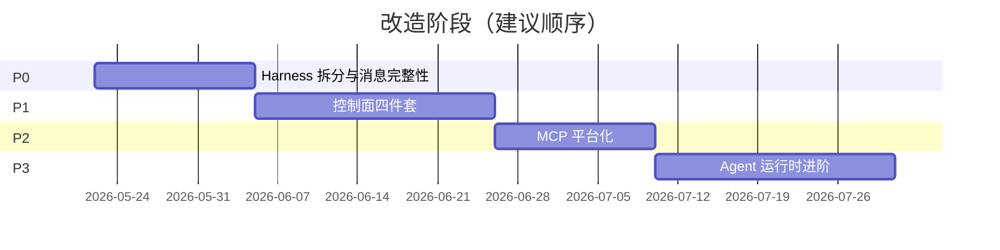

# MCP-Client Agent Harness 改造总路线图

> 最后更新：2026-05-27  
> 定位：从「LLM + MCP 工具网关 + Web UI」升级为「具备控制面的 Agent Client」  
> 参考文档：章节完整 URL 见 [REFERENCES.md](./REFERENCES.md)

## 一、现状评估

### 已有能力（保留并强化）

| 模块 | 现状 | 对应文档章节 |
|------|------|-------------|
| Agent Loop | `chatStream` 多轮工具循环（上限 10 轮），assistant/tool 消息写回 | [s01 Agent Loop](https://learn.shareai.run/zh/s01/) |
| 工具路由 | 多 MCP 服聚合、`ToolNameCodec`、`MCPClientManager` | [s02 Tool Use](https://learn.shareai.run/zh/s02/)、[s19 MCP](https://learn.shareai.run/zh/s19/) |
| 进度通知 | `supportsProgress` + MCP `notifications/progress` + UI 时间线 | [s13 Background Tasks](https://learn.shareai.run/zh/s13/)（部分） |
| 连接治理 | stdio / Streamable HTTP、断线重连、工具列表缓存 TTL | [s19 MCP](https://learn.shareai.run/zh/s19/)（部分） |
| Prompt 基础 | `mcpToolPrompt` + 服务端 `instructions` 合并 | [s10 Prompt Pipeline](https://learn.shareai.run/zh/s10/)（部分） |
| 前端会话 | IndexedDB 本地会话、SSE 流式、工具卡片可视化 | — |

### 核心缺口

| 缺口 | 影响 | 2026 实践对照 |
|------|------|--------------|
| 历史消息不含 tool 上下文 | 多轮 Agent 对话失忆 | Harness 必须持久化完整 message graph |
| 无消息规范化层 | 取消/超时后 API 400、配对失败 | OpenAI/Anthropic 协议硬性约束 |
| 无上下文预算与压缩 | 大 tool 输出撑爆窗口 | AWS MCP 策略：workflow-scoped + 压缩 |
| 无错误分类恢复 | 截断/溢出/瞬态错误直接失败 | Agents SDK Harness：continuation / compact / backoff |
| MCP 仅 tools-first | 无法暴露 Resources/Prompts | MCP 2025–2026 完整能力面 |
| 无权限门 | 工具调用裸执行 | 生产 MCP：OAuth + least privilege + ask |
| Provider 与 Harness 已分离 | ✅ T0 + P0 已完成 | 控制面与执行面分离 |

## 二、目标架构（2026 Harness 模式）

参考 OpenAI Agents SDK、GitHub Copilot Agent Mode、AWS MCP Prescriptive Guidance 的共识。

**T1 已落地**：流式聊天经渠道层 + Inbound Queue（BullMQ/Redis），Harness 仍无渠道分支。

```
┌─────────────────────────────────────────────────────────┐
│  Web UI (public/)                                        │
│  会话展示 · 权限确认 · 工具/进度可视化                    │
└────────────────────────┬────────────────────────────────┘
                         │ SSE / REST
┌────────────────────────▼────────────────────────────────┐
│  API Layer (src/api/)                                    │
│  chatStream：SSE begin → registerSink → publishInbound   │
└────────────────────────┬────────────────────────────────┘
                         │ Envelope
┌────────────────────────▼────────────────────────────────┐
│  Channels (src/channels/)          ← T1 渠道层           │
│  WebChannelAdapter · normalize-web-inbound · registry    │
└────────────────────────┬────────────────────────────────┘
                         │ BullMQ Inbound
┌────────────────────────▼────────────────────────────────┐
│  Message Bus (src/message-bus/)    ← T1 消息总线         │
│  publishInbound · Inbound Worker · OutboundRouter        │
│  OutboundSinkRegistry · idempotency (Redis mcp-client:*) │
└────────────────────────┬────────────────────────────────┘
                         │ InternalMessage[] + onChunk
┌────────────────────────▼────────────────────────────────┐
│  Agent Harness (src/core/agent-harness/)  ← 控制面   │
│  ┌─────────────┐ ┌──────────────┐ ┌──────────────────┐  │
│  │ LoopState   │ │ MessageNorm  │ │ RecoveryManager  │  │
│  │ 轮次/续行   │ │ 规范化/配对  │ │ continue/compact │  │
│  └─────────────┘ └──────────────┘ └──────────────────┘  │
│  ┌─────────────┐ ┌──────────────┐ ┌──────────────────┐  │
│  │ ContextBudget│ │ PermissionGate│ │ PromptPipeline  │  │
│  │ 压缩/落盘   │ │ deny/ask/allow│ │ 分段组装        │  │
│  └─────────────┘ └──────────────┘ └──────────────────┘  │
└────────────────────────┬────────────────────────────────┘
                         │
        ┌────────────────┼────────────────┐
        ▼                ▼                ▼
┌──────────────┐ ┌──────────────┐ ┌──────────────┐
│ AiProvider   │ │ ToolRouter   │ │ SessionStore │
│ ai-provider  │ │ MCP + System │ │ SQLite/IDB   │
└──────────────┘ └──────┬───────┘ └──────────────┘
                        │
               ┌────────▼────────┐
               │ core/mcp/       │
               │ MCPClientManager│
               │ tools/resources  │
               │ prompts/oauth    │
               └─────────────────┘
```

**设计原则**

1. **Harness 拥有控制面，MCP 拥有执行面** — Loop、恢复、压缩、权限在 Harness；MCP 只管连接与调用
2. **外部能力与原生工具同路由、同权限、同 tool_result 格式** — [s19 MCP](https://learn.shareai.run/zh/s19/) 要求
3. **内部 messages ≠ API messages** — 内部可含元数据，发送前 normalize
4. **可观测默认开启** — 每次 tool call 结构化审计日志（2026 生产必备）

## 三、阶段划分



| 阶段 | 周期（估） | 交付物 | 成功标准 |
|------|-----------|--------|----------|
| **P0** | 2 周 | Harness 骨架、完整消息链、非流式对齐 | 10 轮工具对话上下文不断；非流式与流式行为一致 |
| **P1** | 3 周 | 压缩、恢复、权限、Prompt 流水线 | 长会话不崩溃；工具调用可 ask/deny；prompt 可分段维护 |
| **P2** | 2 周 | Resources/Prompts/OAuth/连接状态机 | MCP 能力面完整；远程服可 OAuth |
| **P3** | 3 周 | Todo/Memory/Hook/服务端会话 | 跨会话偏好保留；Hook 可扩展 |
| **Backlog** | 按需 | 多 Agent、Worktree、CLI | 视产品方向决定 |
| **T1** ✅ | 2–3 周 | 渠道层 + 消息总线（**Web 单渠道**） | Web 全链路走 Envelope + Inbound Queue；Harness 无渠道分支 |

> **T1** 已完成（2026-05-27），详见 [T1-channel-bus.md](./T1-channel-bus.md)。飞书/钉钉留 T2，依赖 T1 + P3-04。

## 四、阶段依赖

> **T\***（个人补充任务，见 [T0-architecture.md](./T0-architecture.md)、[T1-channel-bus.md](./T1-channel-bus.md)）与 P 路线图正交，不列入下图依赖。

```
P0-01 Harness 模块拆分
  └─► P0-02 消息规范化
        └─► P0-03 完整历史链（tool_calls + tool results）
              ├─► P1-01 上下文压缩（依赖完整 messages）
              │     └─► P1-02 错误恢复（compact 分支）
              │           └─► P1-03 权限门（工具执行前）
              │                 └─► P2-01 MCP OAuth
              └─► T1-01 Envelope 契约 ✅
                    └─► T1-02 Inbound Queue ✅
                          └─► T1-03 Web Adapter → T1-04 Worker → T1-05 Outbound ✅
P2-02 Resources/Prompts（可与 P1 后期并行）
P3-* 可在 P1 完成后按需启动
T2 飞书/钉钉：T1 完成 + P3-04 Session Store
```

## 五、不建议做的（避免过度工程）

| 跳过/延后 | 原因 |
|-----------|------|
| 自建向量 RAG | 当前无知识库场景；MCP Resources 更合适 |
| 完整多 Agent 团队（[s15](https://learn.shareai.run/zh/s15/)–[s18](https://learn.shareai.run/zh/s18/)） | Client 定位是网关 + UI，编排应在 IDE/服务端 |
| 秒级 Cron 调度 | Web 演示应用无后台常驻需求 |
| 替换 Express 框架 | 与 Agent 能力无关 |
| 引入 React 重写前端 | 现有原生 JS 模块化已够用，优先补 Harness |

## 六、2026 最佳实践对齐清单

| 实践 | 本路线对应任务 | 来源 |
|------|---------------|------|
| Harness 与控制面分离 | P0-01 | OpenAI Agents SDK 2026 |
| 完整 message graph 持久化 | P0-03, P3-04 | MCP / Copilot context passing |
| 工具调用 OAuth + 最小权限 | P2-03, P1-03 | AWS MCP Strategies |
| Workflow-scoped 工具过滤 | P1-06 | AWS：减少 context 占用 |
| 错误分类 + 有预算重试 | P1-02 | [ShareAI s11 Error Recovery](https://learn.shareai.run/zh/s11/) |
| 大输出落盘 + preview | P1-01 | [ShareAI s06 Context Compact](https://learn.shareai.run/zh/s06/) |
| MCP Resources/Prompts 一等公民 | P2-02 | MCP Spec 2025–2026 |
| 结构化 tool call 审计日志 | P1-07 | 生产可观测性共识 |
| Client capabilities 声明 | P2-01 | MCP 握手规范 |
| 会话服务端持久化（可选同步 IDB） | P3-04 | 跨设备 / 恢复 |

## 七、里程碑验收

### M1 — Harness 可用（P0 完成）

- [x] 新建 `src/core/agent-harness/` 目录，Loop 从 Provider 层抽出（T0 + P0）
- [x] 前端历史默认开启，含 tool_calls / tool / reasoning
- [ ] 非流式 `chat()` 支持完整多轮工具循环
- [ ] `temperature` / `max_tokens` 正确传给 API

### M2 — 生产级控制面（P1 完成）

- [ ] 上下文压缩三层策略可用
- [ ] 三类错误自动恢复（continuation / compact / backoff）
- [ ] 工具权限 ask/deny/allow 管道
- [ ] System Prompt 分段 Builder

### M3 — MCP 平台完整（P2 完成）

- [ ] listResources / listPrompts 接入 UI 与 Harness
- [ ] 连接状态机：connected / pending / needs-auth / failed
- [ ] OAuth 流程（至少 Streamable HTTP）

### M4 — Agent Client 完整（P3 完成）

- [ ] 会话内 Todo 规划工具
- [ ] 跨会话 Memory（SQLite）
- [ ] Hook 扩展点（PreToolUse / PostToolUse）
- [ ] 服务端 Session API

---

详细任务清单见各阶段文件。章节索引：[REFERENCES.md](./REFERENCES.md)
